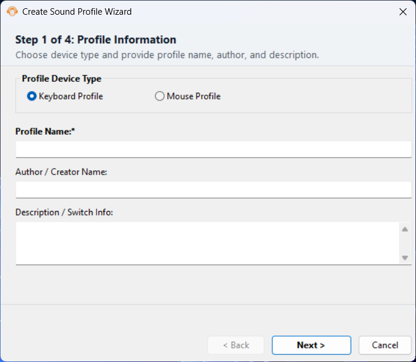
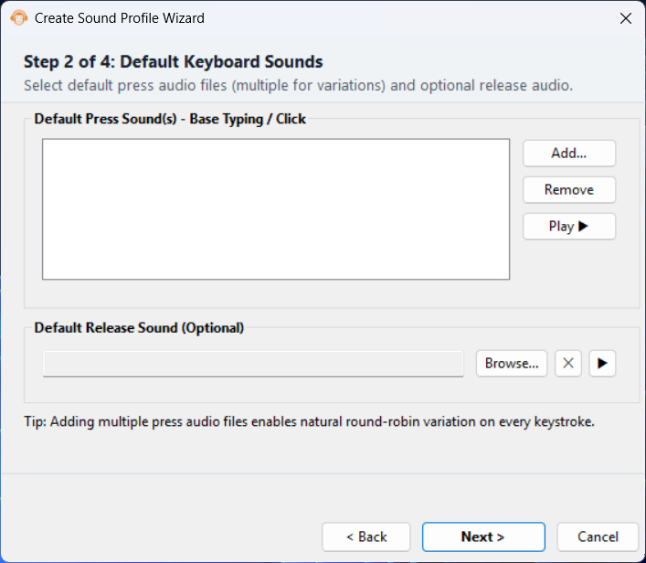
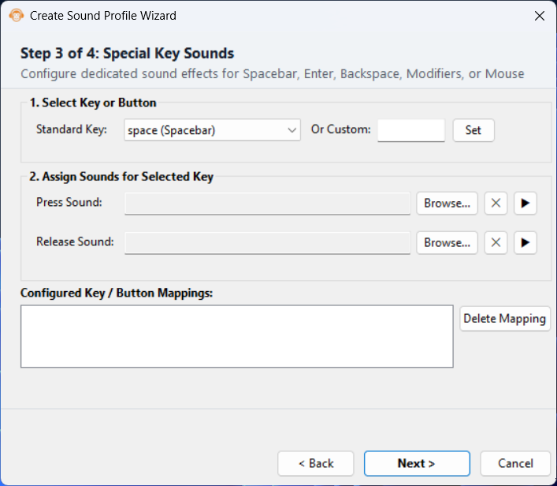
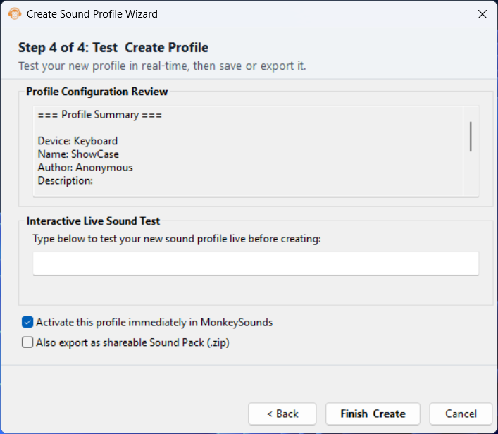

<div align="center">


# MonkeySounds

**Add satisfying keyboard and mouse sounds to every click and keystroke on Windows.**

[](https://github.com/NSTechBytes/MonkeySounds/actions/workflows/build.yml)
[](LICENSE.txt)
[](https://github.com/NSTechBytes/MonkeySounds/releases/latest)

[Download](#-installation) · [Sound Profiles](#-sound-profiles) · [Create a Profile](#-creating-your-own-profile) · [Discord](https://discord.gg/fZejMxtMhf) · [Support on Patreon](https://www.patreon.com/c/nstechbytes)

</div>

---

## What is MonkeySounds?

MonkeySounds is a lightweight Windows app that plays realistic mechanical keyboard and mouse click sounds as you type and click — just like the popular browser extension, but system-wide for **every** application on your PC.

- Runs silently in the system tray
- Zero performance impact — uses a low-latency audio engine
- Ships with **16 keyboard profiles** (Cherry MX, Holy Panda, Alpaca, and more)
- Fully customizable — create your own profiles with any audio files you like
- Portable or installed — your choice

---

## Requirements

| | |
|---|---|
| **OS** | Windows 10 or Windows 11 (64-bit) |
| **Runtime** | None — the EXE is fully self-contained |

---

## Installation

### Option 1 — Installer (recommended for most users)

1. Go to the [Releases page](https://github.com/NSTechBytes/MonkeySounds/releases/latest)
2. Download `MonkeySounds_Setup_vX.X.X.X.exe`
3. Run it and follow the setup wizard

During installation you will be asked to choose a mode:

| Mode | Description |
|---|---|
| **Standard** | Installs to `Program Files`, creates Start Menu & Desktop shortcuts, adds an uninstaller to Windows Settings |
| **Portable** | Copies all files to a folder you choose — no registry entries, no shortcuts. Ideal for USB drives or shared PCs |

### Option 2 — Portable ZIP

If you prefer not to run an installer at all:

1. Download `MonkeySounds-dist` from the latest [Actions artifact](https://github.com/NSTechBytes/MonkeySounds/actions)
2. Extract the folder anywhere you like
3. Double-click `MonkeySounds.exe`

> **Tip:** In portable mode MonkeySounds automatically detects that `settings.json` lives next to the EXE and stores all data in that same folder instead of `%APPDATA%`.

---

## First Launch

When MonkeySounds starts it **hides to the system tray** automatically.

Look for the monkey icon near the clock in your taskbar:

| Action | Result |
|---|---|
| **Double-click** the tray icon | Opens the main window |
| **Right-click** the tray icon | Quick menu: mute keyboard, mute mouse, open settings, exit |

The app starts playing sounds immediately — just open any text editor and start typing!

---

## Main Window

### Sounds Tab

This is where you control everything about how the sounds work.

<details>
<summary><strong>Keyboard Sounds section</strong></summary>

| Control | What it does |
|---|---|
| **Enable Keyboard Sounds** checkbox | Turns keyboard sounds on or off |
| **+ New Profile...** | Opens the Profile Wizard to create a new sound profile from scratch |
| **Preset** dropdown | Switch between installed keyboard profiles |
| **★** (star button) | Mark/unmark the current profile as a favourite — favourites appear at the top of the list |
| **ⓘ** (info button) | Shows the profile name, author, description and number of sounds |
| **▶** (play button) | Plays a quick preview of the current profile |
| **Export** | Saves the current profile as a `.zip` file you can share |
| **Import ZIP...** | Loads a profile from a `.zip` file someone shared with you |
| **Volume** slider | Sets how loud the keyboard sounds are (0–100%) |

</details>

<details>
<summary><strong>Mouse Sounds section</strong></summary>

The Mouse Sounds section works exactly the same way as Keyboard Sounds, but controls the sounds played when you click your mouse buttons.

</details>

### Settings Tab

| Option | Description |
|---|---|
| **Current Version** | Shows the installed version of MonkeySounds |
| **Check for Updates** | Opens the GitHub releases page in your browser |
| **Auto-start on Windows startup** | MonkeySounds will launch automatically when you log in |
| **Show notification on startup** | Shows a tray balloon when the app starts in the background |

### About Tab

Shows the app logo, version info, and links to GitHub, Discord, and Patreon.

---

## Sound Profiles

MonkeySounds ships with the following profiles out of the box:

### Keyboard Profiles

| Profile | Based on |
|---|---|
| `alpaca` | Alpaca V2 switches |
| `apex-pro-tkl-v2` | SteelSeries Apex Pro TKL |
| `banana-split` | Banana Split switches |
| `gateron-black-ink` | Gateron Black Ink switches |
| `gateron-red-ink` | Gateron Red Ink switches |
| `holy-panda` | Holy Panda switches |
| `ios` | iPhone / iOS keyboard |
| `logitech-g915-tkl-brown` | Logitech G915 TKL (Brown) |
| `mx-black` | Cherry MX Black |
| `mx-blue` | Cherry MX Blue |
| `mx-brown` | Cherry MX Brown |
| `mx-speed-silver` | Cherry MX Speed Silver |
| `nk-cream` | NovelKeys Cream switches |
| `opera-gx` | Opera GX browser keyboard |
| `telios-v2` | Telios V2 switches |
| `typewriter` | Vintage typewriter |

### Mouse Profiles

| Profile | Based on |
|---|---|
| `g502x-wireless` | Logitech G502 X Wireless |

---

## Creating Your Own Profile

MonkeySounds includes a built-in **Profile Wizard** that walks you through creating a custom profile step by step — no JSON editing required.

Click **+ New Profile...** in either the Keyboard or Mouse section to open it.

<div align="center">


</div>

<div align="center">


</div>

### What the wizard asks for

1. **Profile name, author, description** — so you can identify it later
2. **Default sounds** — audio files (`.wav`, `.ogg`, `.mp3`) played for any key/button not specifically mapped. You can add multiple files and MonkeySounds will randomly pick one each time for variety
3. **Specific bindings** *(optional)* — assign different sounds to individual keys (e.g. a louder thock for `Space` and `Enter`)
4. **Options** — activate the profile immediately after creation, and optionally export it as a `.zip` for sharing

### Profile folder structure

Every profile is a folder containing a `profile.json` and your audio files:

```
MyProfile/
├── profile.json
├── key_press_1.wav
├── key_press_2.wav
└── key_release.wav
```

`profile.json` example:
```json
{
  "name": "My Profile",
  "author": "YourName",
  "description": "A custom keyboard sound profile",
  "device": "keyboard",
  "sources": {
    "s1": { "press": "key_press_1.wav", "release": "key_release.wav" },
    "s2": { "press": "key_press_2.wav" }
  },
  "keymap": {
    "default": ["s1", "s2"],
    "space":   ["s1"],
    "enter":   ["s1"]
  }
}
```

### Sharing profiles

- **Export**: click **Export** next to any preset to save it as a `.zip`
- **Import**: click **Import ZIP...** and pick the `.zip` — MonkeySounds extracts it and loads it automatically

---

## Where are my settings stored?

| Mode | Location |
|---|---|
| **Standard install** | `%APPDATA%\MonkeySounds\` |
| **Portable** | Same folder as `MonkeySounds.exe` |

Custom profiles you import are saved inside `Sounds\Keyboard\Custom\` or `Sounds\Mouse\Custom\` under the data directory.

---

## Uninstalling

**Standard install:** Go to *Windows Settings → Apps → MonkeySounds → Uninstall*

During uninstall you will be asked:
> *"Also remove all user data (settings, custom sound profiles) from %APPDATA%\MonkeySounds"*

- Leave it **unchecked** to keep your settings and custom profiles
- Check it to do a clean removal of everything

**Portable:** Just delete the folder.

---

## Building from Source

### Requirements

- Visual Studio 2022 (with the **Desktop development with C++** workload)
- Windows SDK 10.0

### Steps

```powershell
git clone https://github.com/NSTechBytes/MonkeySounds.git
cd MonkeySounds

# Debug build
.\Build.ps1

# Release build (also creates dist\ folder)
.\Build.ps1 -Configuration Release -Platform x64
```

The compiled EXE ends up in `x64\Release\MonkeySounds.exe`.  
The `dist\` folder contains the EXE and `Sounds\` folder ready for distribution.

---

## Contributing

Pull requests and profile submissions are welcome!

- **Bug reports / feature requests** → [Open an issue](https://github.com/NSTechBytes/MonkeySounds/issues)
- **New sound profiles** → submit a PR adding your profile folder under `Sounds\Keyboard\` or `Sounds\Mouse\`

---

## Community & Support

| | |
|---|---|
| 💬 **Discord** | [discord.gg/fZejMxtMhf](https://discord.gg/fZejMxtMhf) |
| ❤️ **Patreon** | [patreon.com/c/nstechbytes](https://www.patreon.com/c/nstechbytes) |
| 🐙 **GitHub** | [NSTechBytes/MonkeySounds](https://github.com/NSTechBytes/MonkeySounds) |

---

## License

MonkeySounds is released under the **GNU General Public License v2.0**.  
See [LICENSE.txt](LICENSE.txt) for the full text.

© 2026 MonkeySounds — NSTechBytes
